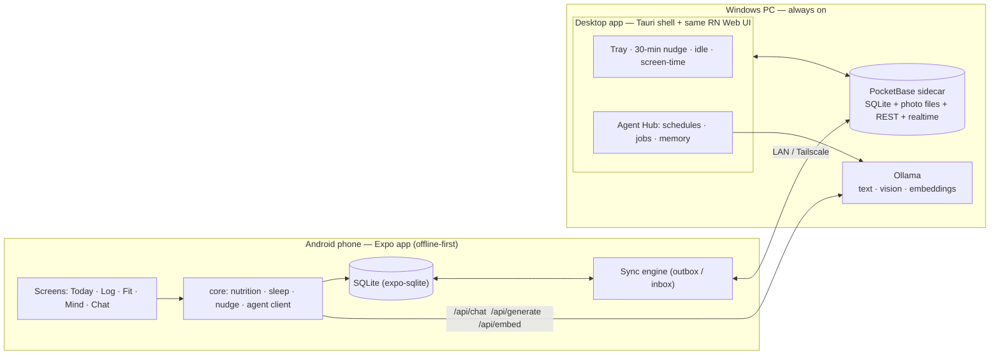
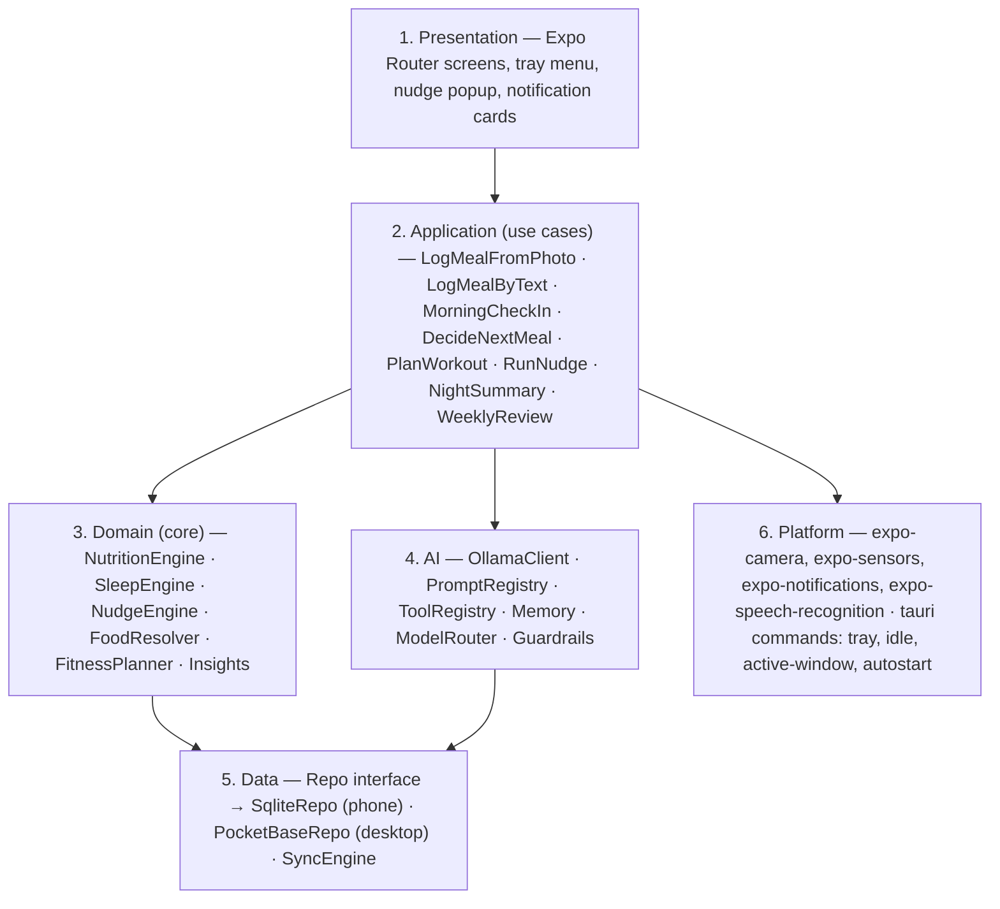
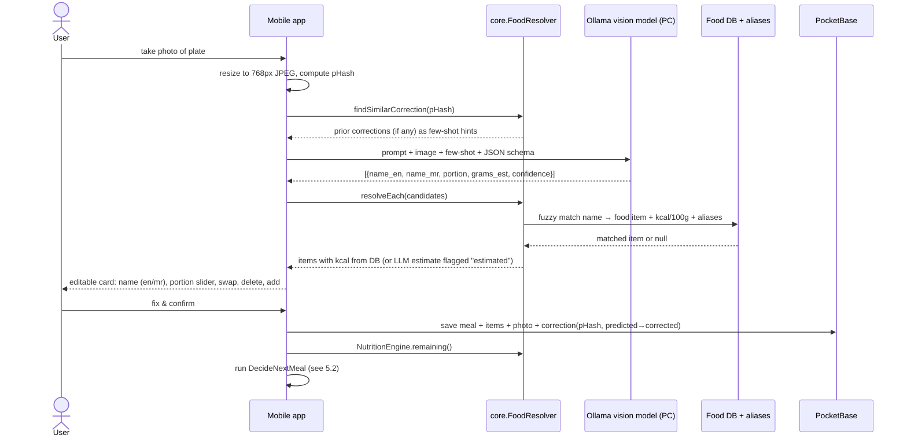
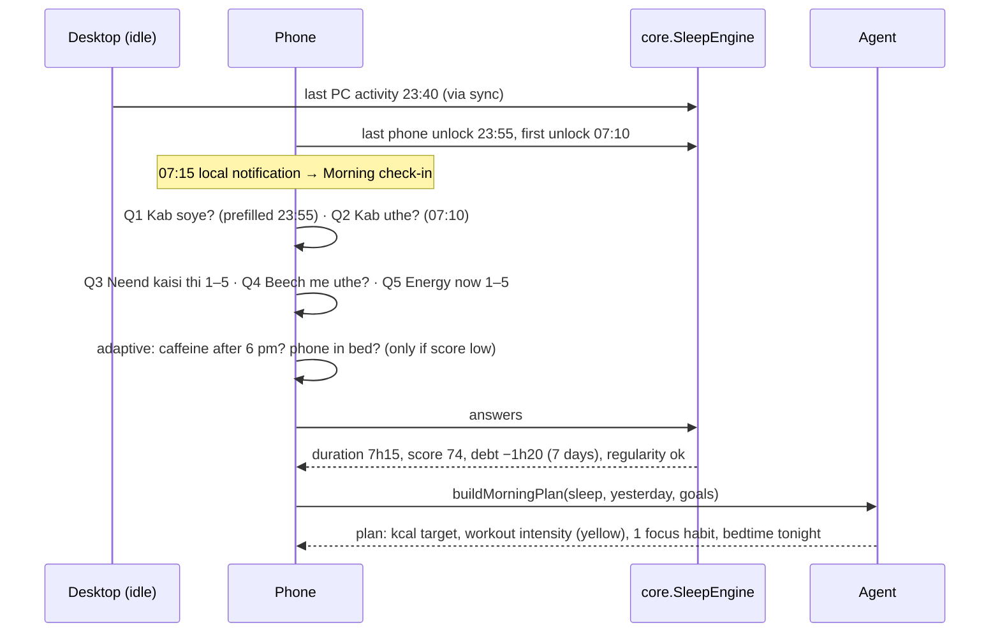
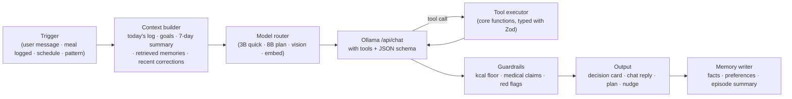

# Smart Health Assistant — End-to-End Architecture

**Status:** design v1, 2026-09-25
**What it is:** a personal, local-first, open-source health companion. Android phone + Windows PC. AI runs on the PC through Ollama. No account, no cloud.

---

## 1. Goals and hard constraints

| # | Constraint | Why |
| --- | --- | --- |
| 1 | **Local-first, private.** All data lives on the phone and the PC. | Health + mood data is sensitive; also no server cost. |
| 2 | **One UI codebase.** React Native + Expo runs natively on Android and, through React Native Web, inside a Tauri shell on Windows. | Solo developer. Writing two UIs kills the project. |
| 3 | **Code does the numbers, AI does perception and language.** Calories, targets, scores, budgets are computed deterministically. The LLM identifies food, explains, plans, motivates. | Small local models are bad at arithmetic and must not be trusted with calorie math. |
| 4 | **Phone works when the PC is off.** Logging, reminders, rules engine keep working. AI tasks queue until Ollama is reachable. | You will not always be at home. |
| 5 | **Three languages:** English, Marathi, Hindi for UI and food names. | Marathi names for food are a core requirement. |
| 6 | **Safety rails.** No diagnosis, no crash diets, calorie floor, helpline card on red flags, escalate to a doctor. | Mental health and a 100 kg starting point need care. |

---

## 2. System overview



### Components

| Component | Runs on | Responsibility |
| --- | --- | --- |
| **Mobile app** (Expo) | Android | Fast logging, camera, voice, step counter, scheduled reminders, sleep check-in, chat, all screens. Works offline. |
| **Desktop app** (Tauri 2 shell loading the Expo web build) | Windows | Same screens, plus: system tray, autostart, nudge popup every 30 min, idle detection, active-window screen-time tracking, water counter, PocketBase sidecar, Agent Hub scheduled jobs. |
| **PocketBase** (sidecar binary) | Windows | Source of truth and sync server. SQLite inside, file storage for food photos, REST + realtime API, admin UI. Zero backend code. |
| **Ollama** | Windows | Text model (coach, planner, summaries), vision model (food photos), embedding model (memory search). |
| **`packages/core`** (pure TypeScript) | both | Nutrition engine, sleep engine, nudge engine, food resolver, agent orchestrator, sync engine, guardrails. No UI, fully unit-tested. |

---

## 3. Monorepo layout

```
smart-health-assistant/
├── apps/
│   ├── mobile/            Expo app (Expo Router). Targets: android, web.
│   │                      `expo export -p web` produces the bundle the desktop shell loads.
│   └── desktop/           Tauri 2 shell (Rust, ~150 lines): tray, autostart, idle time,
│                          active window title, notifications, PocketBase sidecar, loads web bundle.
├── packages/
│   ├── core/              Domain logic: nutrition, sleep, nudges, food resolver, agent, sync, guardrails.
│   ├── data/              Seed datasets: IFCT foods, Marathi/Hindi aliases, Maharashtrian dishes,
│   │                      exercise library (free-exercise-db), nudge messages, prompt templates.
│   └── ui/                Shared RN components: cards, charts, forms, decision card, nudge card.
├── services/
│   └── pocketbase/        Collection schema, pb_migrations/, JS hooks, start scripts.
└── docs/
    ├── ARCHITECTURE.md    (this file)
    └── FEATURES.md
```

**Platform splitting:** files named `*.native.tsx` / `*.web.tsx` handle divergence. Desktop-only calls go through a `platform` adapter: `platform.idleSeconds()`, `platform.activeWindow()`, `platform.showTrayNudge()`. On Android these are no-ops or Expo equivalents.

---

## 4. Layers



### Domain engines (in `packages/core`)

| Engine | Inputs | Outputs |
| --- | --- | --- |
| **NutritionEngine** | profile (weight, height, age, sex, activity), goal | BMR (Mifflin-St Jeor), TDEE, daily kcal target with safe deficit (max 1 kg/week, floor 1500 kcal for men / 1200 for women unless a doctor sets otherwise), protein target (1.2–1.6 g/kg of goal weight), remaining budget, per-meal budget by time of day. |
| **FoodResolver** | text query / vision candidates | Ranked matches from local food DB (fuzzy, Fuse.js), alias lookup in en/mr/hi, portion units (roti, katori, vati, glass, piece, plate), kcal + macros per portion. Falls back to LLM estimate with `estimated=true` flag. |
| **SleepEngine** | bedtime, wake time, quality, wake-ups, heuristics (last phone activity, first unlock, desktop idle) | Duration, sleep score 0–100, regularity (bedtime variance), sleep debt (7-day), red flags (snoring + daytime sleepiness → doctor card). |
| **NudgeEngine** | time, idle state, water count, sitting minutes, calories left, mood, active app | Which nudge to show, which micro-task, in which language. Rate-limited, quiet hours, cooldown, no repeats. |
| **FitnessPlanner** | phase, completion history, readiness (sleep + soreness + mood) | Today's session (green/yellow/red intensity), weekly step goal, progression rules. |
| **Insights** | 7–30 days of logs | Streaks, scores, correlations (sleep vs. kcal, mood vs. movement), weekly stats fed to the AI report. |
| **Guardrails** | any LLM output | Rejects: kcal below floor, medical claims, extreme advice. Detects self-harm language → helpline card, never an LLM reply alone. |

---

## 5. Key flows

### 5.1 Photo → calories, with English + Marathi name, editable



**Vision prompt contract** (structured output via Ollama `format` with a JSON schema):

```json
{
  "items": [
    {
      "name_en": "Poha",
      "name_mr": "पोहे",
      "portion": "1 plate",
      "grams_est": 180,
      "confidence": 0.82
    }
  ],
  "notes": "oil visible, likely 1 tsp"
}
```

**Rules**
- The vision model outputs **names and portions only**. Calories always come from the food DB when a match exists. LLM kcal estimates are shown with an "estimated" badge.
- **Marathi name source order:** alias table → user's own corrections → LLM fallback (saved as a new alias once the user confirms).
- **Learning loop:** every correction is stored (`predictions` table). Similar photos (pHash distance ≤ 10) surface the corrected answer first. The last 10 corrections are injected into the prompt as few-shot examples. Custom foods the user creates go into the DB with en/mr/hi names.
- **Fallbacks:** PC unreachable → photo is queued in the outbox with a "pending AI" badge; user can type/voice-search the DB immediately. Barcode on packaged food → Open Food Facts lookup (offline cache of scanned items).
- **Model choice:** start with a 7–12B multimodal model (Qwen2.5-VL 7B, Gemma 3 12B, or Llama 3.2 Vision 11B class). Keep a **golden set of 50 Indian plate photos** in `packages/data/eval/` to measure accuracy when switching models.

### 5.2 Calorie budget → decisions

```
budget      = dailyTarget − consumedToday
mealsLeft   = planned meals after now (from meal schedule)
perMeal     = budget / mealsLeft
status      = under | on-track | over (over = consumed > target × 1.0 before dinner, or > 1.2 any time)
```

| Situation (computed by code) | Decision card (worded by LLM, facts injected) |
| --- | --- |
| Over budget before dinner | Light dinner options from DB within `budget` (≥ 300 kcal, never skip), 20-min walk, 2 glasses of water, normal breakfast tomorrow. No compensation fasting. |
| Protein under 60% of target by evening | Suggest dal, paneer, eggs, curd, sprouts, soya in the remaining budget. |
| Repeated 4 pm sugar snack (3+ days) | Pre-emptive nudge at 3:45 pm with a planned alternative snack. |
| Under budget by > 30% at night | Gentle "eat something light" — under-eating is also flagged. |
| Late-night eating (after 10 pm) 3 days running | Earlier dinner reminder + sleep nudge; check sleep data. |

Every decision card shows **"Why"**: the numbers used (consumed, target, remaining, protein), so the reasoning is auditable.

### 5.3 Sleep tracking with questions



- **Heuristic pre-fill** makes the check-in a 20-second task; the user only corrects.
- **Weekly extra questions** (Sunday): snoring? daytime sleepiness? morning headaches? Positive pattern → "talk to a doctor about sleep apnea" card. Sleep apnea is common at higher body weight and directly blocks weight loss; handled gently, never diagnosed.
- **Adaptation:** sleep < 6 h → lower workout intensity, protein-forward meals, no late heavy dinner, earlier wind-down nudge.
- **Future:** Health Connect (Android) import for smartwatch sleep and steps; replaces heuristics when available.

### 5.4 Desktop 30-minute nudge

1. Tauri timer fires every N minutes (default 30, configurable).
2. `platform.idleSeconds()` > 300 → skip (user is away). Focus mode on → skip unless water is overdue.
3. `NudgeEngine.pick(context)` chooses by priority: water overdue > sitting 90 min > eyes (20-20-20) > posture > breathing > motivational card from own data.
4. Popup window (always-on-top, small, auto-closes in 25 s) shows message in chosen language + a 2-minute micro-task with a timer. Buttons: Done · Snooze 10 · Skip.
5. Result logged to `nudges` (shown, action). Skip 3× in a row → NudgeEngine lowers frequency for that type instead of nagging.
6. **Doom-scroll guard:** `platform.activeWindow()` sampled every 30 s → sessions per app/site. 45 min continuous on a flagged site → special card "ये नको, हे बघ" showing today's progress ring and a 1-minute reset.

### 5.5 Scheduled agent jobs (Agent Hub on the PC)

| Time / trigger | Job | Output |
| --- | --- | --- |
| 07:00 or first activity | MorningPlan | kcal target, workout, focus habit, based on sleep answers |
| on meal logged | DecideNextMeal | decision card (runs on whichever device logged) |
| 15:45 (if craving pattern) | PreemptiveNudge | alternative snack suggestion |
| 22:30 | NightSummary | 5-line "aaj ka din", scores, memory write |
| Sunday 19:00 | WeeklyReview | Markdown/PDF report, plan adjustments |
| mood ≤ 2 for 3 days, or 3 skipped workouts | CareCheck | softer plan, check-in question, helpline card if needed |

Jobs run inside the desktop app's JS (always alive in tray). Results are written to PocketBase; the phone shows them on next sync or when the scheduled local notification is opened.

### 5.6 Sync

- Every record: `id` (uuid), `device_id`, `updated_at`, `deleted` (soft delete).
- Phone: writes to local SQLite → appends to **outbox** → pushes when PocketBase reachable (LAN IP or Tailscale hostname), then pulls changes since `last_pull_at`.
- Conflict: last-write-wins per record. Meals are append-only so conflicts are rare.
- Photos: uploaded as PocketBase files; phone keeps a thumbnail.
- Discovery: manual PC address in Settings + optional mDNS (`_sha._tcp`) on LAN.

---

## 6. AI agent design

### 6.1 Orchestrator loop



### 6.2 Tools (function calling, Zod-typed, executed by core)

| Tool | Purpose |
| --- | --- |
| `get_today_totals()` | kcal, protein, water, steps, remaining budget |
| `search_food(query, lang)` | DB search with aliases |
| `log_meal(items[])`, `log_water(ml)`, `log_mood(score, note)` | write actions (always confirmed in UI) |
| `get_sleep(days)` | recent sleep records + score |
| `suggest_meals(kcal_max, protein_min, prefs)` | DB-driven options; LLM only words them |
| `plan_workout(readiness)` | from FitnessPlanner |
| `schedule_reminder(time, text)` | local notification |
| `get_insights(range)` | streaks, correlations |
| `open_mini_app(name)` | breathing bubble, grounding, gratitude, tidy timer |

### 6.3 Memory tiers

| Tier | Storage | Example |
| --- | --- | --- |
| Working | today's records | "lunch 620 kcal, water 4 glasses" |
| Profile facts | `agent_memory` type=fact | "vegetarian", "knee pain on stairs", "office 10–7" |
| Preferences | type=preference (from thumbs up/down) | "dislikes oats", "prefers walking at 7 pm" |
| Corrections | `predictions` table | photo X predicted Upma → actually Sabudana Khichdi |
| Episodic | type=episode, weekly compressed summary | "Week 3: −0.6 kg, sleep improved, 2 overeat days" |
| Semantic search | embeddings (nomic-embed-text) in SQLite + `sqlite-vec` | retrieve relevant past journal lines for chat |

### 6.4 Model router

| Job | Model class | Notes |
| --- | --- | --- |
| Nudge wording, quick tips | 2–3B (Qwen 3 / Gemma 3 small) | fast on CPU, keep-alive warm |
| Morning plan, decisions, reframing, chat | 7–8B (Qwen 3 8B, Llama 3.1 8B) | tool-calling capable |
| Food photos | 7–12B multimodal (Qwen2.5-VL, Gemma 3 12B) | names + portions only |
| Memory search | nomic-embed-text / bge-m3 | multilingual embeddings for Marathi |

Set `OLLAMA_HOST=0.0.0.0` and `OLLAMA_KEEP_ALIVE=30m` on the PC. Check the Ollama library for newer small models; the router makes swapping a config change.

### 6.5 Making the agent more powerful (roadmap)

1. **Deterministic core + LLM shell.** Numbers from code, words from the model. Biggest reliability gain, costs nothing.
2. **Structured outputs everywhere.** JSON schema on every call; parse with Zod; retry once on failure; fall back to rule-based text.
3. **Feedback loops.** Thumbs up/down on every suggestion → preferences. Photo corrections → few-shot. Skipped nudges → frequency tuning.
4. **Proactive triggers, not just chat.** Event-driven jobs (meal logged, pattern detected) make it feel like an agent rather than a chatbot.
5. **RAG over trusted sources.** ICMR/NIN dietary guidelines, IFCT, WHO physical-activity guidance in `packages/data/knowledge/`, chunked and embedded. Grounded answers, fewer hallucinations.
6. **Readiness score.** sleep + soreness + mood → today's plan intensity. Simple, powerful, explainable.
7. **Explainability.** Every card shows the data it used. Builds trust and lets you spot wrong inputs.
8. **Evaluation set.** 50 food photos, 30 decision scenarios, 20 chat red-flag cases. Run before switching models.
9. **Voice.** Android speech-to-text for logging; TTS for the morning brief. Whisper via Ollama-compatible server on PC for long notes.
10. **Barcode + packaged foods.** Open Food Facts with offline cache.
11. **Health Connect.** Steps, sleep, heart rate from a watch when available.
12. **Plugin mini-apps.** Each mini-app is a small module with a manifest; the agent can open them via `open_mini_app`. Community can add more.

---

## 7. Data model

```mermaid
erDiagram
  PROFILE ||--o{ GOAL : has
  FOOD_ITEM ||--o{ FOOD_ALIAS : "names in en/mr/hi"
  FOOD_ITEM ||--o{ PORTION_UNIT : "roti/katori/glass"
  MEAL ||--|{ MEAL_ITEM : contains
  MEAL_ITEM }o--|| FOOD_ITEM : references
  MEAL ||--o| PHOTO : "optional"
  PHOTO ||--o{ PREDICTION : "vision result + correction"
  SLEEP_LOG ||--o{ SLEEP_ANSWER : "check-in questions"
  WORKOUT ||--|{ WORKOUT_SET : contains
  WORKOUT_SET }o--|| EXERCISE : references
  AGENT_RUN ||--o{ AGENT_MEMORY : writes

  PROFILE { uuid id; int height_cm; float weight_kg; date dob; string sex; string activity; string lang }
  GOAL { uuid id; float target_weight; float kg_per_week; int kcal_target; int protein_g }
  FOOD_ITEM { uuid id; string name_en; float kcal_100g; float protein; float carbs; float fat; string source; bool custom }
  FOOD_ALIAS { uuid id; string lang; string name }
  MEAL { uuid id; datetime at; string type; int kcal_total; string device_id; datetime updated_at }
  MEAL_ITEM { uuid id; float grams; float kcal; bool estimated }
  PHOTO { uuid id; string file; string phash }
  PREDICTION { uuid id; json predicted; json corrected; string model }
  WATER_LOG { uuid id; datetime at; int ml }
  WEIGHT_LOG { uuid id; date on; float kg; float waist_cm }
  SLEEP_LOG { uuid id; datetime bed; datetime wake; int quality; int wakeups; int score }
  MOOD_LOG { uuid id; datetime at; int score; string note }
  EXERCISE { uuid id; string name; string level; string impact; string media }
  WORKOUT { uuid id; datetime at; string status; int readiness }
  NUDGE { uuid id; datetime at; string type; string action }
  SCREEN_SESSION { uuid id; string app; datetime start; datetime end }
  AGENT_MEMORY { uuid id; string type; text content; blob embedding }
  AGENT_RUN { uuid id; string job; text prompt; text response; json tools; int ms }
```

`AGENT_RUN` stores every prompt/response for debugging and for building the eval set. Local only.

---

## 8. Tech stack decisions

| Decision | Choice | Alternatives considered |
| --- | --- | --- |
| Mobile | **Expo SDK 57** (React Native, Expo Router, expo-sqlite, expo-camera, expo-image-picker, expo-sensors Pedometer, expo-notifications, expo-speech, expo-speech-recognition) | Tauri 2 Android: weaker for camera, voice, steps, background reminders. Flutter: new language. |
| Desktop shell | **Tauri 2** loading the Expo web export. Rust only for tray, autostart, idle time (`user-idle`), active window (`active-win-pos-rs`), sidecar. | Electron: 5× heavier, but acceptable fallback if RN Web + Tauri has webview issues. |
| Shared UI | **React Native Web** (already in your OTP project) | Separate web UI = double work. |
| Sync / source of truth | **PocketBase** sidecar on PC | Custom Node API (more code); Syncthing (no query API); Supabase (cloud, not local). |
| Local DB on phone | **expo-sqlite** + Drizzle ORM | WatermelonDB (heavier), Realm. |
| AI runtime | **Ollama** REST (`/api/chat` with tools + `format` schema) | llama.cpp server directly (fewer conveniences). |
| Embeddings store | SQLite + `sqlite-vec` on PC | Chroma/Qdrant: extra process, overkill. |
| Validation | **Zod** for tool schemas, LLM outputs, sync payloads | — |
| i18n | i18next with en / mr / hi | — |
| Food data | IFCT 2017 (NIN Hyderabad) + curated Maharashtrian list + Open Food Facts | — |
| Exercise data | free-exercise-db (public domain, images) + wger API | — |
| Licence | MIT | — |

**Development on the Mac:** Expo Android build, web build, core tests and Ollama prompts all work on macOS. Only the Windows Tauri installer must be built on the Windows PC.

---

## 9. Security and privacy

- No accounts. PocketBase admin password is generated on first run and stored in the OS keychain (Tauri stronghold / Windows Credential Manager).
- PocketBase binds to LAN only; remote access via Tailscale, never port-forwarding.
- Phone ↔ PC traffic over Tailscale is encrypted; on plain LAN, PocketBase can run HTTPS with a self-signed cert pinned in the app.
- Export/import as JSON zip; optional encrypted backup (age or libsodium).
- Screen-time data never leaves the PC and is off by default.
- Self-harm detection runs as a keyword + small-classifier check **before** the LLM; the helpline card is always shown by code, not by the model.

---

## 10. Build phases

| Phase | Weeks | Deliverable | Done when |
| --- | --- | --- | --- |
| 0 | 0.5 | Monorepo, `core` skeleton, NutritionEngine with tests, Ollama client | `npm test` green, chat hello-world against Ollama |
| 1 | 2 | Desktop tray app: 30-min nudge, water, quick meal/mood log, chat with today's context | You use it daily for a week |
| 2 | 3 | Mobile app: text/voice log, food DB with mr/en, weight trend, PocketBase sync | Log a full day from the phone, see it on PC |
| 3 | 2 | Photo → calories with editable card + corrections loop | 40/50 golden photos correct after edit-free |
| 4 | 2 | Sleep check-in + morning plan + readiness-based fitness plan | 14 mornings logged |
| 5 | 2 | Mind module, mini-apps, night summary, weekly report, insights | First weekly PDF |
| 6 | 1 | Open-source release: README, screenshots, Windows installer, APK | GitHub release v0.1 |

---

## 11. Risks and open questions

| Risk | Mitigation |
| --- | --- |
| RN Web + Tauri webview quirks | Prototype in Phase 1 with 3 screens before committing; Electron fallback. |
| Vision model weak on Indian dishes | DB match + corrections loop + golden set; try 12B if 7B disappoints. |
| Nudge fatigue | Variety, idle skip, frequency auto-tuning, easy snooze. |
| Phone background reliability (Android kills apps) | Use scheduled local notifications, not background timers; battery-optimisation exemption prompt. |
| Marathi coverage in food DB | Curated seed list of ~300 Maharashtrian dishes; users add aliases; ship as open dataset. |
| Over-reliance on AI for mental health | Guardrails, helpline card by code, "talk to a person" nudges, clear positioning as companion. |
